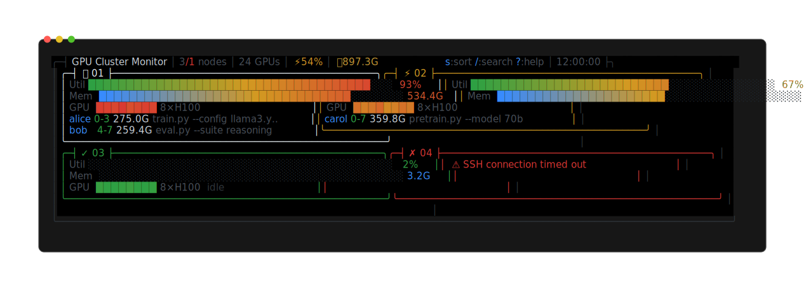
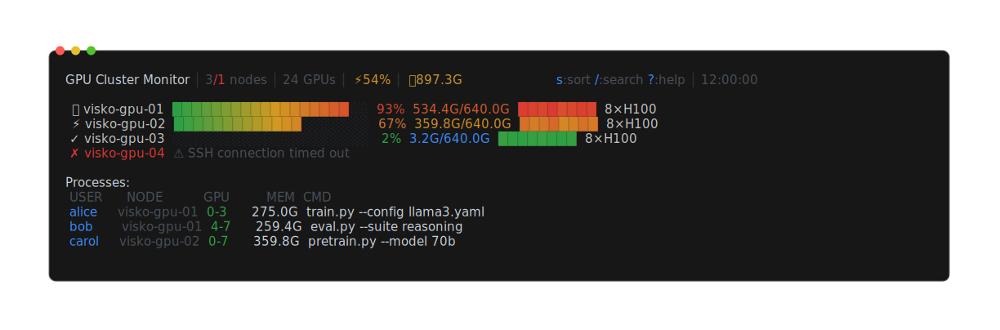

# node-monitor

A fast, interactive terminal dashboard for monitoring GPU utilization across Slurm cluster nodes in real-time. Built in Go with a btop++-inspired TUI.


## Installation

### Pre-built binaries (recommended)

Download from [GitHub Releases](https://github.com/Reed-yang/node-monitor/releases/latest):

```bash
# Linux x86_64
curl -sSL https://github.com/Reed-yang/node-monitor/releases/latest/download/node-monitor_0.1.0_linux_amd64.tar.gz | tar xz
sudo mv node-monitor /usr/local/bin/

# Linux ARM64
curl -sSL https://github.com/Reed-yang/node-monitor/releases/latest/download/node-monitor_0.1.0_linux_arm64.tar.gz | tar xz
sudo mv node-monitor /usr/local/bin/

# macOS Apple Silicon
curl -sSL https://github.com/Reed-yang/node-monitor/releases/latest/download/node-monitor_0.1.0_darwin_arm64.tar.gz | tar xz
sudo mv node-monitor /usr/local/bin/

# macOS Intel
curl -sSL https://github.com/Reed-yang/node-monitor/releases/latest/download/node-monitor_0.1.0_darwin_amd64.tar.gz | tar xz
sudo mv node-monitor /usr/local/bin/
```

### go install

```bash
go install github.com/Reed-yang/node-monitor@latest
```

### Build from source

```bash
git clone https://github.com/Reed-yang/node-monitor.git
cd node-monitor
make build        # outputs ./node-monitor
make install      # copies to ~/.local/bin/
```

## Prerequisites

- SSH access to cluster nodes (passwordless key-based auth recommended)
- `nvidia-smi` installed on each monitored node
- (Optional) Slurm for automatic node discovery via `sinfo`

## Quick start

```bash
# Auto-detect Slurm nodes and launch dashboard
node-monitor

# Monitor specific nodes
node-monitor -n visko-1,visko-2,visko-3

# Monitor a predefined node group
node-monitor -g train

# Single snapshot, no TUI (for scripting)
node-monitor -s
```

## Usage

```
node-monitor [flags]

Flags:
  -n, --nodes string     Comma-separated list of nodes
  -g, --group string     Node group from config file
  -i, --interval float   Refresh interval in seconds (default 2)
  -w, --workers int      Max parallel SSH connections (default 8)
  -s, --static           Print once and exit (no TUI)
  -d, --debug            Verbose SSH error output
      --version          Show version
  -h, --help             Show help
```

**Node resolution order:** `--nodes` flag > `--group` flag > Slurm auto-detection (`sinfo`).

## TUI keybindings

| Key | Action |
|-----|--------|
| `j` / `k` / `Up` / `Down` | Navigate nodes |
| `Enter` / `Click` | Open node detail panel |
| `Esc` | Close detail / search / exit |
| `q` | Quit |
| `s` | Cycle sort: name -> utilization -> memory |
| `g` | Cycle node groups |
| `/` | Search / filter nodes by name |
| `?` | Toggle help overlay |

## Display

### Interactive TUI (default)

Auto-responsive card grid with per-node GPU utilization bars, memory usage, GPU heatmap, and inline process summary:



*Rendered from node-monitor's actual Bubble Tea/Lip Gloss UI with anonymized sample data.*

Press `Enter` on a node to open the **detail panel** with per-GPU bars, full process list, and system info (load average, RAM, driver version).

Node status icons reflect average GPU utilization: `🔥` >80%, `⚡` 50-80%, `✓` <50%, `✗` offline.

### Static mode (`-s`)

Single snapshot printed to stdout, suitable for piping and scripting:



*Rendered from node-monitor's actual static output with the same anonymized sample data.*

#### Updating the screenshots

After changing either display mode, regenerate and verify both README images with:

```bash
make readme-screenshot
make check-readme-screenshot
```

The generator uses the real interactive and static renderers with deterministic, anonymized sample data and a pinned version of [Freeze](https://github.com/charmbracelet/freeze).

## Configuration

Config file: `~/.config/node-monitor/config.toml`

```toml
# Refresh interval (seconds)
interval = 2.0

# Max parallel SSH connections
workers = 8

# Default node list (omit to auto-detect from Slurm)
# nodes = ["visko-1", "visko-2", "visko-3"]

[ssh]
connect_timeout = 5     # SSH connection timeout (seconds)
command_timeout = 10    # Remote command timeout (seconds)
# user = ""             # SSH user (default: current user)
# identity_file = ""    # SSH key path (default: auto-detect)

# Node groups - cycle with 'g' key in TUI
[groups]
# train = ["visko-1", "visko-2", "visko-3", "visko-4"]
# inference = ["infer-1", "infer-2"]
```

A sample config is included at `configs/default.toml`.

**SSH key resolution:** config `identity_file` > `~/.ssh/config` IdentityFile > `~/.ssh/id_ed25519` / `id_rsa` / `id_ecdsa` > SSH agent.

## Architecture

```
main.go                         Entry point, version injection via ldflags
cmd/root.go                     CLI flags (cobra), static/TUI mode dispatch
internal/
  config/config.go              Config loading (viper), SSH key resolution
  model/types.go                Data types: NodeStatus, GPUInfo, GPUProcess, SystemInfo
  slurm/detect.go               Slurm node auto-detection via sinfo
  ssh/
    pool.go                     SSH connection pool with keepalive
    query.go                    Parallel node queries (workers pool)
    parse.go                    nvidia-smi output parsing
  tui/
    app.go                      Bubble Tea model: Update/View loop, keybindings, mouse
    components/
      nodecard.go               Node card grid rendering
      nodedetail.go             Detail panel: per-GPU bars, processes, sysinfo
      gpubar.go                 Gradient progress bars, GPU heatmap
      proctable.go              Process table (aggregated by user)
      header.go                 Header bar with cluster stats
      hostname.go               Smart hostname truncation (common prefix stripping)
      styles.go                 Color palette (btop++ muted tones)
      help.go                   Keybinding help overlay
```

## License

MIT
